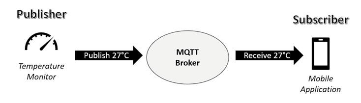

# MQTT used in project 'Autonoom Manoeuvreren In De Haven'
- Name: Hidde Gerritsen
- Studentnumber: 1079142
- educator: Anne de Gier & Alexander Slaa
- Date: 15-5-2025
- Submission: feedbackmoment
- project: AMIDH
- Vak: Project 7/8

# Executive Summary

# Introduction
This report has been written in response to a specific requirement set by our project developer, which states:  
> *"The prototype must use MQTT as the data transfer protocol."*

The project is led by Geert Mosterdijk, an employee at **PK Marine**, a company specialising in radar and maritime measurement technology.

Currently, the mooring of ships in harbours is largely carried out by the visual judgement of the captain, supported by sailors and a limited number of sensors placed around the ship. This manual process is both inefficient and error-prone. Human error can lead to excessive throttle use, unnecessary energy consumption, and increased operational costs due to the need for manual labour.

Considering the shipping industry moved 11.61 billion tons of cargo in 2023 (Fortune Business Insights, 2024), even a small improvement in the mooring process can lead to significant economic and environmental gains. Automating this process would not only reduce human error but also increase operational efficiency.

To realise this, Geert Mosterdijk envisions a system where multiple sensors are placed around the ship. These sensors will send real-time data to a central unit, which will then control the ship’s engines and propellers accordingly. The communication between the sensors and the central unit will be handled using the MQTT protocol — the core subject of this report.

### Main Research Question
> *How can we apply MQTT in our prototype to transfer data between different modules?*

To answer this question, the report is divided into several sub-questions, each addressing a key aspect of MQTT and its suitability for our use case:

1. What is MQTT and how does it work?  
2. What are the benefits of MQTT for real-time modular communication systems like ours?  
3. How does MQTT compare to other communication protocols?
4. What are the main challenges of using MQTT in a maritime?
5. How should MQTT topics and QoS be configured to handle multiple modules? 
6. What do existing studies or projects tell us about the use of MQTT in autonomous or semi-autonomous systems?

# Theoretical Framework

To understand how MQTT can be applied in our maritime prototype, it is important to explore the origin, purpose, and current usage of this protocol, as well as relevant alternatives and contextual factors.

## MQTT: Origin and Functionality

MQTT (Message Queuing Telemetry Transport) was developed in 1999 by IBM for use in remote oil pipelines with unreliable connections. It is a lightweight messaging protocol designed for constrained devices and low-bandwidth, high-latency networks. It uses a **publish/subscribe** model, where clients send messages to a **broker**, which then forwards those messages to other clients subscribed to specific **topics**.

`Picture: “Raspberry Pi and MQTT Essentials”` 

This architecture decouples senders and receivers, making the system modular, scalable, and suitable for real-time distributed systems like ours (MQTT.org, n.d.).

## Relevance in Embedded and Autonomous Systems

MQTT is widely used in:
- Home automation
- Industrial IoT
- Autonomous robotics

> “MMQTT is a lightweight and flexible network protocol that strikes > the right balance for IoT developers:
> - The lightweight protocol allows it to be implemented on both heavily constrained device hardware as well as high latency / limited bandwidth networks.
> - Its flexibility makes it possible to support diverse application scenarios for IoT devices and services.”

-IBM Developer (n.d.)

## Comparison with Alternative Protocols

MQTT is ofcourse not the only protocol used in embedded systems:

- **HTTP** is a relatively heavy protocol; it is less suited for real-time sensor data.
- **WebSocket** provides a two-way communication but requires a constant connection and is more complex.
- **CAN (Controller Area Network)** is fast and reliable for short-range communication, commonly used in vehicles and ships.

MQTT offers more flexibility, is easily expandable and light-weight

## Terminology and Scope

In this report:
- A **module** is any sensor or actuator component with its own microcontroller.
- The **central point** or **MQTT broker** is part that receives and distributes all the data from and to the modules
- The **prototype** refers to a prototype that will be the end-product for this project

# Methods
This report is based on information coming from literature research only, hoping to answer all the main- and sub-questions as written in the introduction. 

## Research Steps

To answer the main and sub-questions, the following steps were taken:

- Literature Review on MQTT

    To address sub-question 1 and 2, MQTT documentation (MQTT.org), and technical blogs were used to explain the core concepts and benefits of MQTT, especially in embedded or IoT contexts.
- Comparison with Alternative Protocols

    Sub-question 3 was answered through comparative analysis. Key sources (Naik, 2017) were used to evaluate HTTP, WebSocket, and CAN against MQTT based on technical parameters like latency, bandwidth, and scalability.

- Challenges and Configuration

    To answer sub-questions 4 and 5, sources describing MQTT implementation in embedded systems (HiveMQ. (n.d.)) were analysed. These included studies on QoS, topic structure, network limitations, and security models.

- Application in Related Systems

    To address sub-question 6, existing use cases of MQTT in similar systems — such as autonomous vehicles, industrial automation, and robotic platforms — were explored to draw relevant insights.

## Protocol Selection Criteria

To systematically compare MQTT with other communication protocols, the following evaluation criteria were used:

|Criteria|Explanation|
|---------|--------|
|Latency|Is the protocol suitable for fast, low-delay communication?|
|Reliability|Can it guarantee message delivery?|
|Scalability|Can it support multiple modules?|
|Bandwidth Efficiency|How much data overhead does the protocol add?|
|Complexity|How difficult is the implementation on embedded hardware?|

These criteria were selected based on the goals of the prototype and supported by research literature (Naik, 2017).

# results

# Conclusions/recommendations

# References

MQTT.org. (n.d.). *What is MQTT?* Retrieved May 15, 2025, from https://mqtt.org/faq/

IBM Developer. (n.d.). Understanding MQTT. Retrieved May 15, 2025, from https://developer.ibm.com/articles/iot-mqtt-why-good-for-iot/

Naik, N. (2017). Choice of effective messaging protocols for IoT systems: MQTT, CoAP, AMQP and HTTP. Proceedings of the IEEE International Systems Engineering Symposium (ISSE), 1–7. https://pure.port.ac.uk/ws/portalfiles/portal/12197128/IoT_Messaging_Protocols_Naik.pdf

Fortune Business Insights. (2024). Cargo Shipping Market Size, Share & COVID-19 Impact Analysis, By Cargo Type (Dry Bulk Cargo, Liquid Bulk Cargo, General Cargo, and Container Cargo), By End-Use Industry (Food, Manufacturing, Oil & Ores, Electrical & Electronics, and Others), and Regional Forecast, 2024–2032. https://www.fortunebusinessinsights.com/cargo-shipping-market-102045

HiveMQ. (n.d.). MQTT Essentials: A lightweight IoT protocol. Retrieved May 15, 2025, from https://www.hivemq.com/mqtt-essentials/

# Appendix

