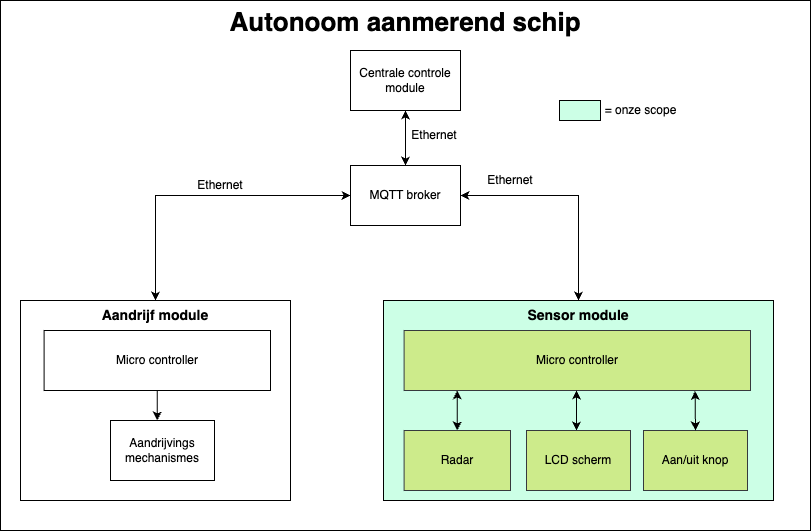

# Autonoom Manouevreren In De Haven
"Autonoom Manoeuvreren In De Haven" is een project opgestart door *Geert Mosterdijk*, mede-eigenaar van het bedrijf Sens2Sea. Zij zijn gespecialiseerd in maritieme radar- en meetsystemen en hebben de wens om Schepen autonoom te laten aanmeren in de haven. Zij zien dit voor zich door een systeem te maken voor op schepen waarbij er verschillende sensor- en aandrijfmodules zijn, deze werken vervolgens nauw samen om ervoor te zorgen dat de aandrijfmodules het schip autonoom naar de kade kunnen voortbewegen. 

## Probleem
Het autonoom aanmeren van schepen lijkt iets wat anno 2025 allang mogelijk moet zijn, kijk bijvoorbeeld naar de zelf-rijdende auto's. Echter is dit door de vele verschillende omstandigheden waar je mee te maken hebt op een schip nog niet toegepast, denk hierbij aan weersomstandigheden, stroming of de getijde. 

Er bestaan reeds sensormodules voor op schepen die het al mogelijk maken de afstand tot de kade te meten. Deze zijn echter lastig/duur te onderhouden, in bezit van grote bedrijven en niet open source. Door hier zelf een variant op te ontwikkelen die al deze problemen tackled, hoopt Geert dat de scheepvaart in de toekomst efficienter en duurzamer zal zijn

## Impact
Doordat huidige systemen niet open-source zijn, is onderhoud of reparatie alleen uit te voeren door de producent. Dit brengt veel kosten, onnodige wachttijden of ongewenst afval met zich mee. Door het creeeren van een module die juist makkelijk te onderhouden is, zorg je ervoor dat er altijd iemand op een schip aanwezig is die in staat is om dit uit te voeren. Dit kan bedrijven veel geld en tijd schelen.

Helaas zijn mensen niet perfect en maken deze soms wel eens foutjes, wanneer je deze factor weg laat bij het aanmeren van schepen, zullen fouten minder snel voorkomen en zal de energie van de motoren op veel efficientere wijze worden ingezet. Dit kan, in zo'n enorme economie als de scheepvaart, al veel CO2 uitstoot besparen en dus een enorme impact hebben op het klimaat.

## Context
Dit project 7/8 zal zich focussen op het ontwikkelen van de sensormodules die de taak hebben om de afstand tot de kade te meten en deze door te sturen naar de MQTT broker. Vanaf daar kan deze data verwerkt worden en de motoren aangestuurd worden. In de onderstaande afbeelding zie je overzichtelijk hoe dit er uit zal komen te zien, waarbij alle groene onderdelen binnen de scope van dit project zijn. De overige onderdelen zullen niet behandeld worden, deze worden op dit moment gezien als eventuele vervolg op dit huidige project.

*Afbeelding: scope project*

## Opdracht
Vanuit de opdrachtgever zijn er verschillende requirements opgesteld, deze zijn allemaal uitgebreid beschreven in de [requirement analyse](./documentatie/projectdocumentatie/Requirementanalyse.md). Hieronder staan de belangrijkste punten nog onder elkaar met hoe die zijn aangepakt:

* #### Het moet nauwkeurig afstanden tot objecten kunnen meten: 
    Voor het meten van de afstand tot de kade of andere objecten is er een sensor nodig, daarom is er onderzoek gedaan naar welke het beste zou passen binnen dit project, zie [hier](./documentatie/onderzoek/eigenonderzoek/Sensoronderzoek/SensorResearch.pdf). In dit verslag worden alle requirements uitgebreid meegenomen. Uit de conclusie is gebleken dat de XM125 radar sensor het meest geschikt is voor dit project, echter is de theorie niet altijd zoals de praktijk. Om die reden is er een [experimenteel onderzoek](./documentatie/onderzoek/eigenonderzoek/Experimenteelonderzoek/experimentalresearch.pdf) gedaan om er zeker van te zijn dat de gekozen sensor zowel nu als in de toekomst op correcte wijze de afstand kan meten
Voor het detecteren van de kade of verschillende objecten met de sensor, moet er worden gekeken naar iets genaamd een [bundel](./documentatie/onderzoek/eigenonderzoek/Bundelonderzoek/BundelonderzoekE.md). In dit literatuur onderzoek wordt er gekeken naar wat de bundel op een sensor is en hoe het 'readings' beïnvloed. Uit het onderzoek is gebleken dat waar het binnen de andere requirements valt we een zo'n klein mogelijke bundel willen hebben en hierop hebben we keuze kunnen maken voor een sensor.

* #### Het ontwerp moet waterdicht en robuust zijn
    Doordat er problemen waren met 3d printen is er een behuizing van hout gemaakt. Door deze keuze is het prototype niet waterdicht. Maar het prototype is wel redelijk robust. Als je het prototype van 5 cm laat vallen blijft het heel.
* #### Het moet voldoen aan de SDI-standaarden
    SDI (standardized distributed intelegence) is een methode om meerdere losse systemen met elkaar te laten communiceren. Het idee is om elke module standaard eenheden te laten gebruiken voor het uitwisselen van gegevens. Denk hierbij aan snelheid in m/s, afstand in m, tempratuur in C, tijd in s, etc. Hierdoor kunnen alle modules met elkaar praten zonder extra informatie nodig te hebben omdat alles in een eenheid is. In het project is de eenheid in m (meter) gebruikt. Om dit voor het gehele project en eventuele toekomstige uitbreidingen gelijk te houden zijn de SDI standaard gedocumenteerd in [de SDI docs](./documentatie/projectdocumentatie/SDIdocs.md)
* #### Het moet alle data via MQTT versturen
    Aangezien MQTT een veel gebruikte oplossing is voor communicatie tussen verschillende microcontrollers is er een eis dat dit gebruikt wordt in het project. Om ervoor te zorgen dat alle functionaliteiten tot het uiterste benut worden is er onderzoek naar gedaan, zie [hier](./documentatie/onderzoek/eigenonderzoek/MQTTonderzoek/MQTT_research.pdf). Uit de resultaten van dit onderzoek blijkt dat dit communcatieprotocol een goede basis is voor als het eindproducten van dit project straks op grotere schaal zal worden toegepast
* #### Het systeem moet op afstand bedienbaar zijn via een gebruikersinterface
    In het project is er gebruik gemaakt van MQTT. Met MQTT is de sensor te stoppen en te starten. Deze commands gaan over de to `sensor1/action`. Gebruik `STOP` of `START` om de sensor te stoppen en te starten. De gebruikersinterface van de eigen MQTT server kan gebruikt worden om op de juiste topic deze commands te sturen.

## Het prototype
Er is als eindproduct van dit project een prototype ontworpen die alle functionaliteiten kan en requirements kan aantonen, deze wordt gedomonstreerd in de [demo video](./demovideo.mp4).

Voor het gebruiken of namaken van het prototype verwijzen we je naar de [handleiding](./documentatie/projectdocumentatie/handleiding.md), hierin is volledig beschreven hoe het prototype gebouwd is met eventuele visuele 
beschrijvingen.

Een lijst van overige bestanden die de werking/bouw van het prototype verhelderen:
- [Architectuur diagram](./documentatie/diagrammen/Architectuur.png)
- [Interne Achitectuur diagram](./documentatie/diagrammen/InterneArchitectuur.png)
- [Flowchart code](./documentatie/diagrammen/Flowchart.pdf)
- [Elektrisch schema](./documentatie/diagrammen/ElektrischSchema.pdf)

## Conclusie
Er is in dit project een prototype gebouwd dat afstanden kan meten, met als eis dat objecten tot 20 meter met een nauwkeurigheid van 1 centimeter gemeten worden en deze informatie via MQTT kan versturen. Door verschillende onderzoeken te doen is gebleken dat de XM125 radar sensor het meest geschikt zou zijn voor dit project. In praktijk was dit tot op zekere hoogte ook het geval, echter heeft de sensor niet verder dan 3 meter gemeten. Voor de volledig benutting van de capaciteiten van de sensor was software nodig die niet openbaar beschikbaar is. Het gerealiseerde prototype voldoet aan de belangrijkste eisen, zoals een stevige behuizing en het gebruik van een open communicatieprotocol. In de testomgeving werkt alles zoals het hoort, maar het testen op een echt schip in het water is er helaas niet aan te pas gekomen. Al met al laat dit project zien dat je met vrij simpele middelen een open-source sensormodule kan ontwerpen die de ideeen van Geert Mosterdijk realiseren.

## Advies
De sensor die we nu gebruiken heeft de mogelijkheden om tot in iedergeval 20m 'accuraat' te meten, zoals is vernoemd in het [experimenteel onderzoek](./documentatie/onderzoek/eigenonderzoek/Experimenteelonderzoek/experimentalresearch.pdf), maar zo ver wij weten ziet hier een licentie achter en omdat wij echter 'externe problemen' hadden in het project hebben wij niet de mogelijkheid gekregen om hier in verder te kijken. 
Wij raden dan ook zeker aan om hier in verder te kijken, kijk of je de juiste functies kan 'bemachtigen' zodat de sensor zijn volledige potentieel kan bereiken en op een langere afstand dan 3 meter 'accuraat' kan meten.
Voor de volgende stap buiten de sensor, zouden wij nog adviseren om het in water te testen want daar hebben wij de mogelijkheid voor gekregen, om te kijken hoe de sensor reageer op het 'op en neer' bewegen van het water/ golven.

## Advies 2
De huidig gebruikte radar sensor (XM125) heeft de mogelijkheid om tot 20 meter accuraat te meten, zoals is vernoemd in het [experimenteel onderzoek](./documentatie/onderzoek/eigenonderzoek/Experimenteelonderzoek/experimentalresearch.pdf). echter is dat voor de omvang en context van dit project een stapje te groot, voor het maken van het eerste prototype zou ons advies zijn een sensor te kiezen die eenvoudiger is en makkelijker in gebruik. Dan heb je een prototype die een goede basis legt voor eventuele verdere ontwikkelingen.

Als er in een vervolgproject met de XM125 verder gewerkt zal worden zouden wij het volgende adviseren: Zorg ervoor dat alle benodigde software volledig onder controle is zodat alle toepassingen ervan goed benut kunnen worden en pas de tests hier op aan, de manier waarop de huidige tests zijn opgezet heeft daar geen rekening mee gehouden en zal dan ook niet meer valide zijn. Daarnaast zou deze sensor beter te pas komen in een proffesionelere testopstelling of op een echt schip, gezien de range van zo'n 20 meter. Bij het testen in een andere omgeving kan er direct met meer rekening gehouden worden, denk hierbij aan het schommelen van het schip of lastige weersomstandigheden. Dit zorgt ervoor dat een vervolgproject zich al meer op de details kan gaan focussen en het een bruikbaarder prototype wordt.

## Contributors

- Hwayda Bashair (1049850)
- Hidde Gerritsen (1079142)
- Olaf Goudriaan (1071349)
- Mees van der Waal (1052159)

© https://github.com/spodermees/Project-7-8
