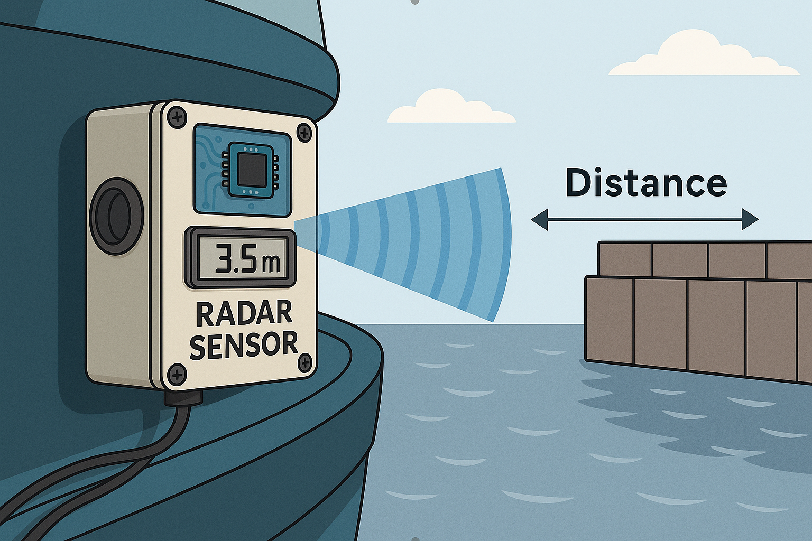

# Distance Detection

<center>Project 78</center>
<br><br>


<br><br><br>
Name: Olaf Goudriaan  
Student Number: 1071349  
Class: TI2A  
Date: 15/5/2025
Project: Autonoom manoeuvreren in de haven
Educator: A.M. de Gier, A.P.A. Slaa
1st time 


## Executive Summary
This report presents a short-range distance measurement test using the XE125 sensor as part of the project Autonoom Manoeuveren in de Haven. The project's goal is to explore the feasibility of automating ship docking using sensor data.

Under controlled conditions, the XE125 radar sensor was tested for measurement accuracy over distances ranging from 0.10 to 3.00 meters, using a reflective aluminium surface as the target. The sensor's readings were compared to the reference measurements taken with a measuring tape.

The experiment showed that the sensor consistently achieved an average accuracy within 0.02 meters. This confirms its potential for close-range maritime applications. However, due to the current software limitations, measurements beyond 3 meters was not possible and need further investigation. But the XE125 sensor shows a promise as a reliable sensor for autonomous docking systems.


## Introduction:
This report is written for the Project Autonoom Manoeuveren in de Haven. This project requires a sensor capable of detecting the quay from a ship.

The project is led by Geert Mosterdijk, an employee of PK Marine, a company specializing in radar and maritime measurement technologies.

Currently, ship docking in harbours is performed manually by a captain and crew, with limited support from onboard sensors. This approach is prone to human error, which can lead to inefficient throttle use and increased fuel consumption. Additionally, the reliance on manual labour contributes to higher operational costs.

To reduce those costs, Geert Mosterdijk envisions a system where multiple sensors are placed around the ship. These sensors will send real time information to a central unit. This unit will control the engines based on the data received. 

A separate paper within the project has provided the necessary information supporting the selection of the XE125 sensor, which will be experimentally tested in this research for its accuracy and performance over a 20-meter range. [1]


## Theoretical Framework

Radar technology has long time played a crucial role in maritime navigation. Ships have radars that are optimized for long-range object detection. This is primarily used for collision avoidance and situational awareness. These systems provide reliable detection of large objects at distances. However, autonomous docking requires short range measurements to navigate confined environments such as harbours.

The Acconeer XE125 sensor uses pulsed coherent radar (PCR) technology, offering centimeter-level accuracy and a small hardware footprint. Such features make it a promising candidate for autonomous docking systems in the maritime sector, where similar environmental challenges and spatial constraints exists. [2]

### Research Question
To what extent does the XE125 distance sensor achieve a measurement accuracy of 1 cm across distances up to 20 meters under controlled conditions?


### Research Setup

The XE125 distance sensor was connected to a Laptop with the acconeer-python-exploration tool via USB-C for data acquisition. The sensor was mounted on a stable platform at a height of 1.1 meters, aligned perpendicular to a aluminium surface. The aluminium plate, 1 mm thick, was selected to ensure consistent and stable reflectivity. 

Distances from 1 meter to 20 meters were marked at 1-meter intervals using a measuring tape. For each distance, a measurement was recorded to evaluate the consistency of the sensor. The sensor's output was compared to the actual distance, recorded, and noted in a data table. Data was logged through the Acconeer exploration tool.

To assess sensor accuracy at shorter ranges, additional measurements were taken from 0.10 meters to 1 meter, with intervals of 0.10 meters.

### Measurement Instruments
1. XE125 Radar sensor
    - Description: A XE125 [3] sensor that to a laptop via usb-c.
- Components:
    - XE125
    - LH132 Lens kit
2. Measuring tape
    - Description: A 20 meter measuring tape.

## Setup Instructions:
1. Measuring tape:
    1. Unroll and stretch the measuring tape along a flat surface, ensuring it remains straight and flat.
2. Sensor module:
    1. Plug the XE125 sensor in the laptop with usb-c cable.

## Data Analysis
1. Compare the distance measured from the measuring tape with the distance measured from the sensor.
2. Calculate the average difference between the measuring tape and the sensor.

## Test Setup
The sensor software was configured with the following settings. [Appendix A]

Note: The `end_m` parameter was set to 3 meters in the Acconeer software. This limits the sensor's measurement range to 3 meters during testing. The restriction was due to a software limitation. Testing beyond 3 meters may require different settings in the software.


## Test

|Test number|Distance (m) (measuring tape) | Distance (m) (reading sensor) | Average Error (m) |
|-|-|-|-|
|1| 0.10 | 0.10 | +0.00 |
|2| 0.20 | 0.19 | -0.01 |
|3| 0.30 | 0.31 | +0.01 |
|4| 0.40 | 0.42 | +0.02 |
|5| 0.50 | 0.49 | -0.01 |
|6| 0.60 | 0.61 | +0.01 |
|7| 0.70 | 0.70 | +0.00 |
|8| 0.80 | 0.79 | -0.01 |
|9| 0.90 | 0.90 | +0.00 |
|10| 1.00 | 1.01 | +0.01 |
|11| 1.50 | 1.49 | -0.01 |
|12| 2.00 | 2.02 | +0.02 |
|13| 2.50 | 2.49 | -0.01 |
|14| 3.00 | 3.00 | +0.00 |
|15| 3.50 | Not able to measure | - |


## Results
The data shows that the sensor is very accurate until the object is out of range. The measurements have a margin of error of approximately +-0.02 meters due to the aluminum plate sometimes not being perfectly straight, or the measuring tape not always being perfectly straight or flat.

## Conclusion
The XE125 radar sensor demonstrated high accuracy in short-range distances up to 3 meters, with a maximum deviation of +-0.02 meters. These results suggest the sensor is well-suited for close-range applications such as ship docking in a harbour. Although the sensor is theoretically capable for longer distances, the current software setup restricted the measurements beyond 3 meters. Future tests should explore the sensor's full range capabilities. 

Within the tested range, the sensor provided reliable and consistent data, making it a strong candidate for integration into autonomous control systems.


## Sources
[1] Bashair, H. (2025). SensorResearch. Available: [sensor](./../Sensoronderzoek/SensorResearch.pdf)
[2] Acconeer AB, “XE125 Radar Sensor Datasheet,” 2024. [Online]. Available: https://www.acconeer.com/products/xe125/

## Appendix
[A]
```json
{
  "start_m": 0.25,
  "end_m": 3.0,
  "max_step_length": null,
  "max_profile": "PROFILE_5",
  "close_range_leakage_cancellation": false,
  "signal_quality": 15.0,
  "threshold_method": "CFAR",
  "peaksorting_method": "STRONGEST",
  "reflector_shape": "GENERIC",
  "num_frames_in_recorded_threshold": 100,
  "fixed_threshold_value": 100.0,
  "fixed_strength_threshold_value": 0.0,
  "threshold_sensitivity": 0.5,
  "update_rate": 50.0
}
```