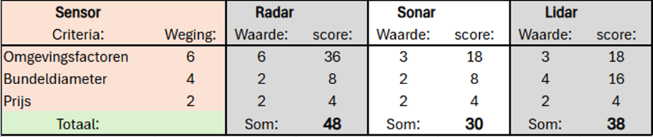
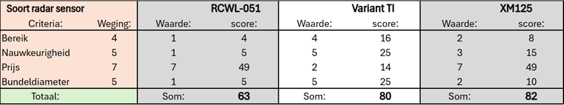

# Sensor onderzoek

## Inleiding 
Het aanmeren van schepen wordt momenteel door schippers gedaan. Dit verloopt niet altijd soepel en op de meest efficiënte manier. Bij grote schepen kan dit lijden tot hoge energiekosten en eventuele schadevergoedingen. Hierdoor wil het bedrijf "Sens2Sea" het aanmeren van schepen in de haven automatiseren door middel van sensoren. Om dit te realiseren wordt er eerst een prototype ontwikkeld waarin deze sensoren modulair kunnen werken. In dit literatuuronderzoek wordt onderzocht wat de meest geschikte sensor is voor dit prototype. Dit wordt gedaan door eerst te kijken naar alle mogelijke sensoren die minimaal een afstand van 1 centimeter tot 20 meter en de snelheid van het schip kunnen bepalen.
 
## Theoretisch kader
Voorafgaand aan dit literatuuronderzoek is er een onderzocht hoe de bundeldiameter van een sensor de metingen beïnvloeden (zie bijlage). Hieruit is geconstateerd dat een zo klein mogelijke bundeldiameter beter geschikt is voor de beoogde toepassing. Zo zijn verschillende objecten beter te onderscheiden.
Methode 
Om de hoofdvraag, 'Wat is de meest geschikte sensor voor het prototype?', te beantwoorden, wordt eerst de deelvraag onderzocht: ' Welke sensoren kunnen zowel afstanden van minimaal 1 centimeter tot 20 meter meten, als de snelheid van het schip bepalen? '.
De sensoren die voldoen aan de criteria van de deelvraag zullen worden vergeleken op basis van de resistentie tegen omgevingsfactoren, de grootte van de bundeldiameter en de prijs. De sensor met de hoogste score zal worden gebruikt om de meest geschikte soort te vinden voor het prototype. De verschillende soorten zullen dus worden vergeleken op basis van het bereik, de bundeldiameter en de prijs om zo een advies te vormen voor de meest geschikte sensor voor het prototype.

## Resultaten

Hieronder volgt een tabel waarin verschillende sensoren worden vergeleken en gewogen op basis van de resistentie tegen omgevingsfactoren, de grootte van de bundeldiameter en de prijs. Een grotere resistentie tegen omgevingsfactoren, een kleinere bundeldiameter en een lagere prijs resulteren in een hogere score. De radar sensor heeft de hoogste som van alle scores.

Hieronder volgt een tabel waarin meerdere radar sensoren worden vergeleken en gewogen op basis van hun bereik, nauwkeurigheid, prijs en bundeldiameter. Een groter bereik, een hogere nauwkeurigheid, een lagere prijs en een kleinere bundeldiameter resulteren in een hogere score. De XM125 radar sensor heeft de hoogste som van alle scores.

## Conclusie/advies
Uit het literatuuronderzoek en de afwegingen is gebleken dat de XM125 radar sensor het meest geschikt is voor het prototype. Er wordt aangeraden deze te gebruiken voor het huidige prototype maar over te gaan naar een TI variant radar sensor bij verdere ontwikkeling. Dit komt doordat de TI variant beter scoort op alle criteria behalve de prijs. Als de prijs bij verdere ontwikkeling een lagere weging heeft zal de TI variant hoger scoren en dus de betere keus zijn. Voor nu wordt de XM125 aangeraden.

## Definities
Bundeldiameter- De bundeldiameter is de breedte van de straal die een sensor gebruikt om objecten te detecteren.

## Bijlage 

[sensorafwegingen](/Sensoronderzoekafwegingen.xlsx)

## Bronnen
Van der Waal, M. (2025, 21 maart). Bundelonderzoek. Geraadpleegd van[bundelonderzoek](./../Bundelonderzoek/Bundelonderzoek.md)