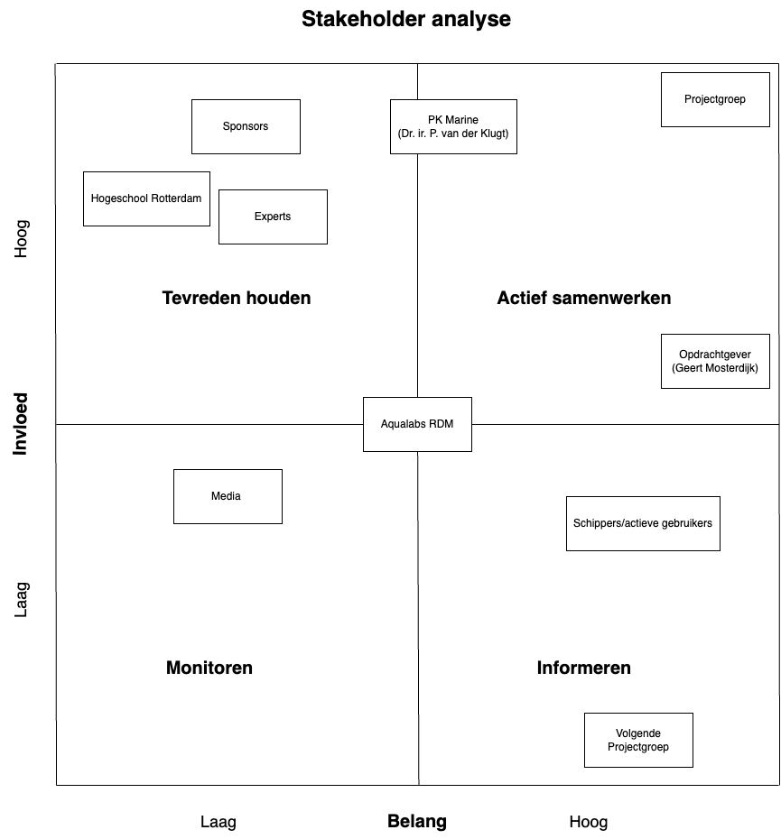

# Stakeholder-analyse

## Context

"Autonoom Manoeuvreren In De Haven" is een project opgestart door Geert Mosterdijk, mede-eigenaar van het bedrijf Sens2Sea. Zij zijn gespecialiseerd in maritieme radar- en meetsystemen en hebben de wens om Schepen autonoom te laten aanmeren in de haven. Zij zien dit voor zich door een systeem te maken voor op schepen waarbij er verschillende sensor- en aandrijfmodules zijn, deze werken vervolgens nauw samen om ervoor te zorgen dat de aandrijfmodules het schip autonoom naar de kade kunnen voortbewegen.

## Inleiding
Binnen een project als deze heb je veel te maken met externe partijen die toch invloed hebben op het verloop, door deze op een rijtje te hebben weet je precies wie je op welke manier moet informeren betrekken. Alle stakeholders die te maken hebben met 'Autonoom Menoeuvreren In De Haven' zijn overzichtelijk in kaart gebracht in dit diagram. Ook staan ze in verder in deze analyse beschreven, zoals bijvoorbeeld de naam, wie ze zijn en op welke manier ze invloed hebben (gehad).

## Stakeholders

### Projectgroep Autonoom manouvreren in de haven

De projectgroep bestaat uit Hwayda Bashair, Hidde Gerritsen, Olaf Goudriaan en Mees van der Waal. Deze personen zijn volledig verantwoordelijk voor alle keuzes die gemaakt worden en hoe dit project verloopt. Zij moeten nauw samenwerken 

### Geert Mosterdijk

Dit is de belangrijkste stakeholder en mede-oprichter van het bedrijf Sens2Sea, Hij heeft grote impact met betrekking tot dit project van hij moet alles goedkeuren en alles moet hem besproken worden. Aangezien het zijn bedrijf is heeft hij ook groot belang dat alles (optijd) afkomt voor een 'normale' prijs. Wekelijks hebben wij met Geert op het RDM afgesproken om te bespreken wat de stand van zaken is, en vooral hoe vanaf daar verder. Zo is hij altijd op de hoogte geweest en kon hij ons helpen waar nodig. Alle [requirements](./Requirements.xlsx) zijn gevormd aan de hand van de eisen van Geert en volledig beschreven in de [requirementanalyse](./Requirementanalyse.md). 

### PK Marine Dr. ir. P. van der Klugt

De projectgroep is niet veel aanraking gekomen met deze stakeholder. Als collega van Geert Mosterdijk heeft hij nog steeds groot belang of het project soepel verloopt. Bij eventuele afwezigheid van Geert was het gemakkelijk langs Peter te lopen voor technische vragen en hulp.

### Experts

Onze expert(s) is Jan, hij is wat jonger persoon die veel in aanraking komt met Geert en Peter. Hij begeleidt ook andere schoolprojecten en kunnen daarom ook bij hem terecht voor technische vragen en project vragen. Zijn impact is hierdoor ook hoog, maar zijn belang is minder dan die van Peter en Geert.

### Sponsors

Niet van toepassing

### Hogeschool Rotterdam

Hogeschool Rotterdam, is meder de reden dat deze opdracht bestaat. Maar hebben niet per se het hoogste belang dat het project succesvol wordt afegrond, maar ze hebben weel veel impact (vooral de leraren) door feedback te geven en met de sprint reviews.

### Aqualabs RDM

Op het feit na dat we fysiek de locatie wat ervoor zorgt dat ze automatisch iets van impact en belang hebben, doen ze niet heel veel direct met het project.

### Media

Er is niet te maken met media

### Schippers/ actieve gebruikers

Er is nog geen contact gelegd met enige 'externe' gebruikers

### Volgende groepen

Het is bij de projectgroep mog niet bekend of dit een estafette project of wie er mee doorgaan
