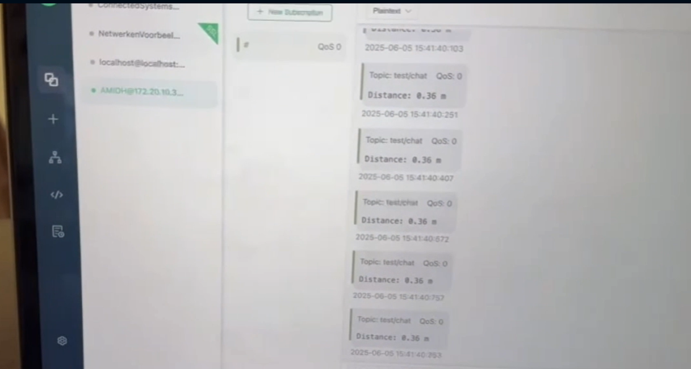

# Gebruikersacceptatietest – Autonoom Manoeuvreren in de Haven

## Doel van de test

Het doel van deze gebruikersacceptatietest is om vast te stellen of het prototypesysteem voor autonoom manoeuvreren voldoet aan de functionele eisen van de opdrachtgever. De nadruk ligt op de juistheid van de sensormetingen, betrouwbaarheid van data-overdracht via MQTT en foutafhandeling via logging.

---

## Testomstandigheden

Testdatum: 5 juni 2025

Locatie: Hogeschool Rotterdam – Eindmarkt

Getest door: Projectgroep 7/8 + 3 externe testgebruikers (niet bij project betrokken)

Toelichting methode:

Elke test werd 3 keer herhaald om consistentie te waarborgen.

Metingen en logdata zijn opgeslagen in CSV-bestanden.

Realtime resultaten werden weergegeven op een lokaal LCD-scherm/ Groot scherm op de muur.

Er is een video-opname gemaakt van de test (Zie demo video).

Testopstelling

---

## Apparatuur

| Onderdeel       | Specificatie                              |
| --------------- | ----------------------------------------- |
| Microcontroller | Raspberry Pi 5                            |
| Sensor          | Waterdichte ultrasoon HC-SR04             |
| Protocol        | MQTT via Mosquitto (broker draait lokaal) |
| Verbinding      | Wi-Fi via Eduroam                         |
| Behuizing       | Houten prototype met kit-afdichting       |
| Interface       | LCD 20x4 + terminal logging via Python    |

## Testcases

| Nr. | Testonderdeel                    | Aanpak                                         | Verwachte uitkomst                                | Resultaat | Bewijsstuk                                |
| --- | -------------------------------- | ---------------------------------------------- | ------------------------------------------------- | --------- | ----------------------------------------- |
| 1   | Sensor meet afstand              | Meet op 3 vaste afstanden (50cm, 100cm, 150cm) | Binnen 1 sec juiste waarde (+/- 5cm)              | ✅          | Demovideo/ Foto hieronder [1]               |
| 2   | Data-overdracht via MQTT         | Simuleer 10 metingen per seconde, 30 sec lang  | Geen packet loss, data binnen 100ms vertraging    | ✅         | Screenshot hieronder [2]       |
| 3   | Behuizing houdt sensor droog     | Dompeltest (5 min besproeien met water)        | Geen condens of vocht in behuizing                | ❌         | Foto’s + visuele inspectie door 2 testers |
| 4   | Logging van fouten werkt correct | Verwijder netwerkkabel tijdens werking         | LCD toont foutmelding, log bevat disconnect-error | ✅         | Demovideo  |

---

## Visuele Ondersteuning

[1] 
[2]

## 💬 Feedback van opdrachtgever / eindgebruiker

> "De sensoren reageren goed, maar het zou fijn zijn als de metingen ook visueel weergegeven worden op een dashboard."
> "De MQTT-verbinding is stabiel, maar er is geen indicatie als het tijdelijk wegvalt."

---

## ✅ Conclusie & Acceptatie

Op basis van de testresultaten en feedback kan geconcludeerd worden dat het systeem:

- **Geaccepteerd** is door de opdrachtgever.
- **Geen** aanpassingen meer nodig heeft.

---

## Changelog

|Versie|Datum|Beschrijving|
|---|---|---|
|1|02-06-2025|Gebruikersacceptatie test opgesteld voor de eindmarkt|
|2|05-06-2025/ 06-06-2025|Geberuikersacceptatie test ingevult na het horen van de feedback gegeven op de eindmarkt|
|3|30-06-2025|Gebruikersacceptatie test veranderd op feedback van de opleverset|
