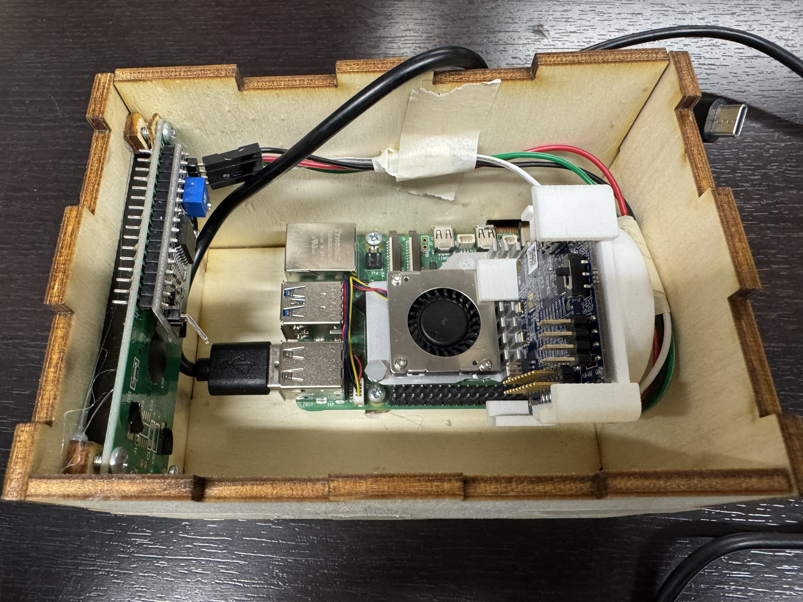

# Setup van de Raspberry Pi

**NOTE: In deze setup guide verwachten we dat je kennis hebt over hoe je de Raspberry Pi moet flashen en erin moet komen met ssh.**

## Benodigdheden
- 4x female to female jumper wires
- 1x I2C LCD Screen
- 1x Raspberry Pi 5 (of Raspberry Pi 4) met Raspbian OS (64 bit) + ethernet kabel en power supply
- 1x XE125 Radar sensor + usb-a -> usb-c kabel
- 12x 3x6mm schroeven
- Behuizing (Zie eerste stap)

## Hardware
### Behuizing
1. Print de behuizing uit met een 3d printer (zie behuizing.obj)
2. Installeer het lcd scherm, de raspberry pi en de radar sensor zoals op de foto




### LCD
Er zijn 4 aansluiting bij het LCD scherm. Deze zijn: VCC, GND, SCL, SDA. Zoek indien nodig de pinout voor jouw model op.
1. Sluit de 5V van de raspberry aan op de VCC van de LCD.
2. Sluit de GND van de raspberry aan op de GND van de LCD.
3. Sluit de SCL van de raspberry aan op de SCL van de LCD.
4. Sluit de SDA van de raspberry aan op de SDA van de LCD.

Als de raspberry power krijgt dan zal de backscreen van de LCD aan gaan.

### XE125 Sensor
De XE125 sluit je aan met een usb kabel. Doe de kant met usb-a in de raspberry in 1 van de 4 poorten. Doe de andere kant in de usb-c poort van de XE125.

Zie hiervoor ook het [elektrisch schema](../diagrammen/ElektrischSchema.pdf).

## Raspberry Pi setup
### Systeem
Zorg dat je een Raspbian 64 bit OS hebt en zorg dat je in de commandline zit.

Eerst gaan we de Raspberry Pi updaten. Daarnaast installeren we ook meteen python3 en pip.
```bash
sudo apt update && sudo apt install python3 python3-pip
```

Omdat we een 64 bit OS gebruiken moeten we 32 bit support aanzetten. Dit is omdat de libraries van Acconeer 32 bit zijn.
```bash
sudo dpkg --add-architecture armhf
sudo apt update
sudo apt install libc6:armhf libgpiod2:armhf
```
Hierna moet je de Raspberry Pi rebooten.
```bash
sudo reboot
```
Dit zorgt ervoor dat alles herstart. Doe je dit niet zullen er dingen niet werken.
Om de controleren of het instaleren goed is gegaan kun je `uname -m` gebruiken. Dit moet `aarch64` aangeven.

Omdat we een I2C Screen gebruiken moeten we I2C aanzetten. dit doe je door `sudo raspi-config` te typen. 
1. Hierin navigeer je naar 'Interface Options'
2. Dan selecteer je I2C
3. Kies 'Yes' 
4. Navigeer terug en ga naar 'Finish'

Hierna reboot je de Raspberry Pi.
```bash
sudo reboot
```

Hierna moet je de I2C-tools installeren.
```bash
sudo apt install i2c-tools
```


### Virtual Software
Hierna kun je een venv maken. Dit is een virtual envirement. 
Een venv maak je doormiddel van in een directory naar keuze het command te gebruiken.
```bash
mkdir ~/autonoom/
cd ~/autonoom/
python -m venv ./venv
```

Nu je een venv hebt gemaakt kun venv activeren.
```bash
source venv/bin/activate
```
Als je venv wilt deaciveren type je `deactivate`.

Nu je je venv hebt geactiveerd kun je dingen met pip instaleren. We beginnen met de SDK van Acconeer te installeren.
```bash
pip install --upgrade acconeer-exptool[algo]
pip install smbus2
```

Nu we de tool hebben kunnen we de setup aanroepen. Je word gevraagd voor welk platform. Kies Linux.
```bash
python3 -m acconeer.exptool.setup
```

Als je het nog niet had gedaan kan je nu de XE125 verbinden met de Raspberry Pi.

Om te kijken of het apparaat herkent word kun je het volgende command doen
```bash
ls /dev/ttyUSB*
```
Nu krijg je waarschijnlijk de volgende poorten te zien: `/dev/ttyUSB0` en `/dev/ttyUSB1`. De eerste is gebruikt om data te versturen en ontvangen. Meestal is dit `/dev/ttyUSB0`. Als je de Raspbian OS gebruikt hoef je geen extra drivers te installeren. Anders heb je deze nodig: `CP210x`.

Note: Als jouw usb poorten allebei anders zijn moet je die veranderen in de code.

Om MQTT te gebruiken moet je de volgende libray installeren.
```bash
pip install paho-mqtt
```

Ook voor de LCD Screen hebben we een library nodig.
```bash
pip install RPLCD
```

Voor de websocket hebben we ook een library nodig.
```bash
pip install flask flask-socketio eventlet
```

**Optional**
Als je de sensor firmware wilt updaten heb kun je de volgende commands uitvoeren. (LET OP: Hier heb je wel een acconeer account voor nodig) En volg de instructies die worden gegeven.
```bash
pip install beautifulsoup4
python3 -m acconeer.exptool.flash flash -d XM125 -f
```


## Code

Als de code niet werkt doordat jouw user geen machtigingen heeft moet je de machtigingen geven met het volgende command. hierna moet je ook rebooten.
```bash
sudo usermod -a -G dialout $(whoami)
sudo reboot
```

De testcode staat bij [code](../../software/raspberrypi/project.py).


Om het hele systeem te testen is er ook een broker nodig. Je verbind met de broker door het IP address, port, gebruikersnaam en wachtwoord aan te passen naar de gegevens van jouw broker. Voor nu staat de gebruikersnaam en het wachtwoord erin voor de broker die is meegeleverd ([broker](../../software/broker/)).

```py
import numpy as np
from acconeer.exptool import a121
import paho.mqtt.client as mqtt
from RPLCD.i2c import CharLCD
from flask import Flask, render_template_string
from flask_socketio import SocketIO
import time
import threading

checkSensor = True

# MQTT details
broker = "172.20.10.3"  # Replace with your MQTT broker IP
port = 1883             # Replace with your MQTT broker port
username = "Hidde"      # Replace with your MQTT username
password = "3332ks"     # Replace with your MQTT password
topic = "sensor/data"     # Replace with your MQTT topic

# Flask setup
app = Flask(__name__)
socketio = SocketIO(app)

# LCD setup
lcd = CharLCD(i2c_expander='PCF8574', address=0x27, port=1,
              cols=16, rows=2, dotsize=8,
              charmap='A00', auto_linebreaks=True)
lcd.clear()

# Sensor setup
sensorClient = a121.Client.open(serial_port="/dev/ttyUSB0")
sensor_config = a121.SensorConfig()

def on_message(sourceClient, userdata, message):
    payload = message.payload.decode()
    if(message.topic == "sensor1/action" and payload == "STOP"):
        lcd.write_string("Stopping sensor")
        checkSensor = False
        return
    if(message.topic == "sensor1/action" and payload == "START"):
        lcd.write_string("Starting sensor")
        checkSensor = True
        return
    print(f"[MQTT] Topic: {message.topic}, Message: {payload}")


def initSensor():
    sensor_config.profile = a121.Profile.PROFILE_3
    sensor_config.step_length = 2
    sensor_config.num_points = 100
    sensor_config.sweeps_per_frame = 8
    sensor_config.hwaas = 16
    sensorClient.setup_session(sensor_config)
    sensorClient.start_session()

# MQTT setup
mqttClient = mqtt.Client()
mqttClient.username_pw_set(username, password)

def initMQTT():
    mqttClient.connect(broker, port, 60)
    mqttClient.on_message = on_message
    mqttClient.loop_start()
    mqttClient.subscribe(topic)

@app.route('/')
def index():
    return render_template_string("""
        <!DOCTYPE html>
        <html>
            <head>
            <title>Live Sensor Distance</title>
            <script src="//cdnjs.cloudflare.com/ajax/libs/socket.io/4.7.2/socket.io.min.js"></script>
            </head>
            <body style="font-family:sans-serif;">
            <h1>Live Distance Reading</h1>
            <p id="distance">Waiting for data...</p>
            <script>
                const socket = io();
                socket.on('distance', data => {
                    console.log("adsf");
                    document.getElementById('distance').innerText = `Distance: ${data} m`;
                });
            </script>
            </body>
        </html>
    """)

def sensor_loop():
    try:
        initSensor()
    except Exception as e:
        lcd.write_string(f"XE125 ERROR: {e}")
        sensorClient.close()
        return

    initMQTT()
    try:
        while True:
            if(not checkSensor):
                lcd.write_string("Sensor stopped")
                time.sleep(1)
                continue
            result = sensorClient.get_next()
            frame = result.frame
            averaged = np.mean(frame, axis=0)
            smoothed = np.convolve(averaged, np.ones(5)/5, mode='same')
            smoothed = smoothed - np.min(smoothed)
            threshold = np.max(smoothed) * 0.5
            smoothed[smoothed < threshold] = 0
            peak_idx = np.argmax(smoothed)
            step_m = sensor_config.step_length * 0.005
            distance_m = peak_idx * step_m

            lcd.clear()
            lcd.write_string(f"Distance: {distance_m:.2f} m")
            mqttClient.publish(topic, f"Distance: {distance_m:.2f}")
            socketio.emit('distance', f"{distance_m:.2f}")
            time.sleep(0.1)
    except Exception as e:
        sensorClient.stop_session()
        sensorClient.close()
        mqttClient.loop_stop()
        mqttClient.disconnect()

def start_sensor_thread():
    thread = threading.Thread(target=sensor_loop)
    thread.daemon = True
    thread.start()

if __name__ == '__main__':
    start_sensor_thread()
    socketio.run(app, host='0.0.0.0', port=5000)
```
