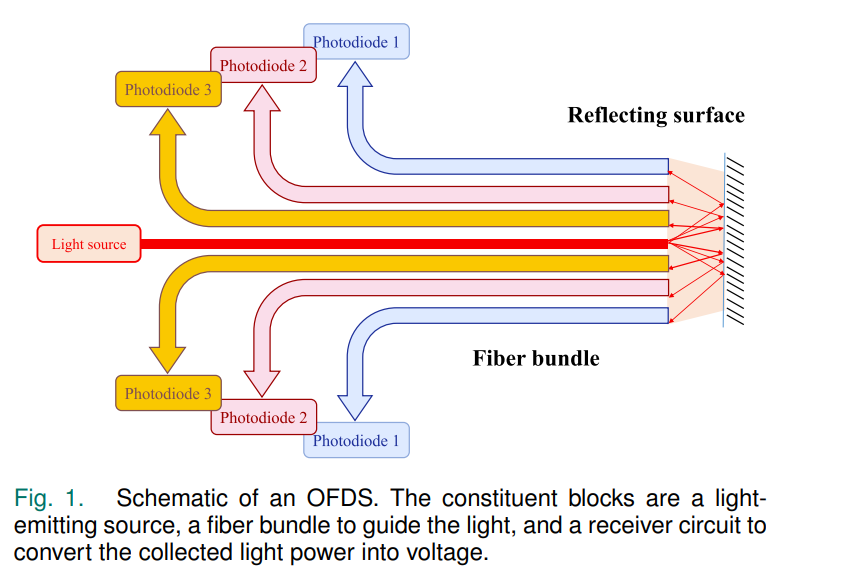

# TODO vertalen

# Onderzoek

Onze sensor moet aan de volgende criteria voldoen:
| characteristic |   | proriteit |
| -------------- | - | --------- |
| range | +50m | 5 |
| fov (packet beam) | zo klein mogelijk | 5 |
| Kosten | zo laag mogelijk | 1 |

De range is hoe ver de sensor met precisie kan meten. De fov is hoe breed de packet beam is. Dus dit gaat over hoe breed de beam is die uit de sensor komen (zie plaatje).
___

onderzoek: 
| sensor | range | fov (degre) | kosten | golflengte |
| ------ | ----- | ----------- | ------ | ---------- |
| (TI) TIDEP-01024 | 8m | 70° | $249,- | 76-GHz to 81-GHz | 
| (TI) AWR2544 | +200m | ? | $249,- | 76-GHz to 81-GHz | 
| (TI) AWR2243 |200m - 250m | ? | ? | 76 - 81 GHz |
| Continental ARS540 | 300m | 60° | ? | 76-GHz to 77-GHz |  

Linkjes  
- [TIDEP-01024](https://www.ti.com/tool/TIDEP-01024)
- [AWR2544](https://www.ti.com/lit/ds/symlink/awr2544.pdf?ts=1741175716659&ref_url=https%253A%252F%252Fwww.ti.com%252Fsensors%252Fmmwave-radar%252Fproducts.html)  
- [AWR2243](https://www.ti.com/lit/ds/symlink/awr2243.pdf?ts=1741173524093&ref_url=https%253A%252F%252Fwww.google.com%252F) -> [range](https://e2e.ti.com/support/sensors-group/sensors/f/sensors-forum/1025116/awr2243-awr2243-vs-awr1843-vs-awr1642-maximum-distance)
- [Continental ARS540](https://www.continental-automotive.com/en/components/radars/long-range-radars/advanced-radar-sensor-ars540.html)